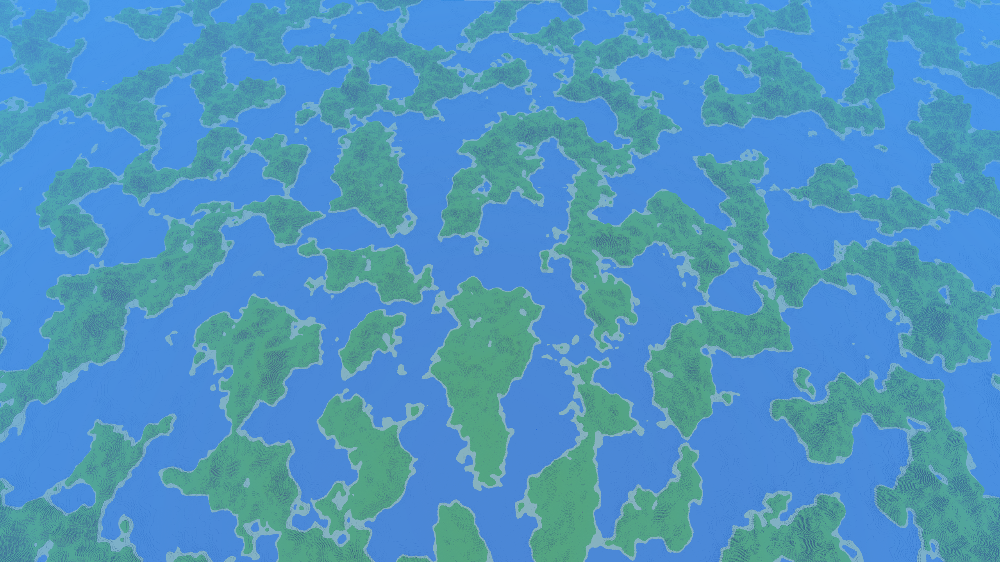
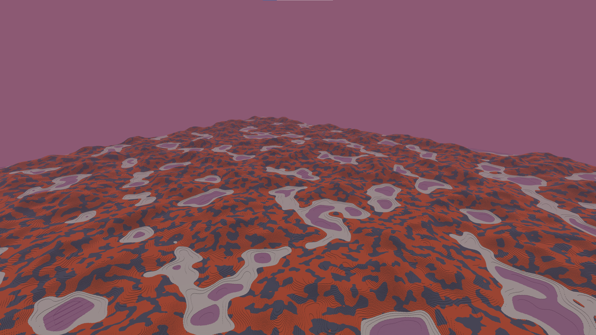
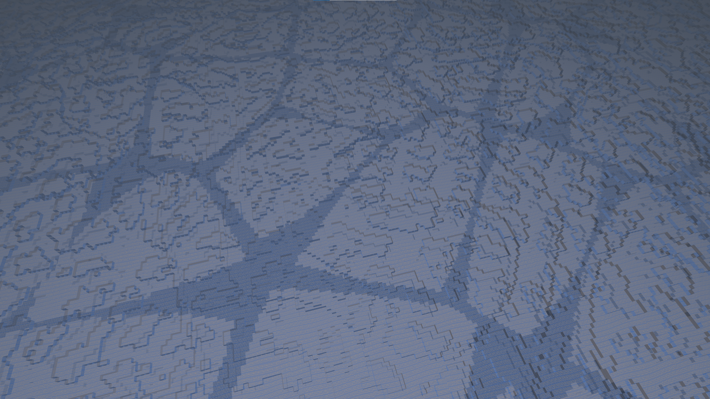
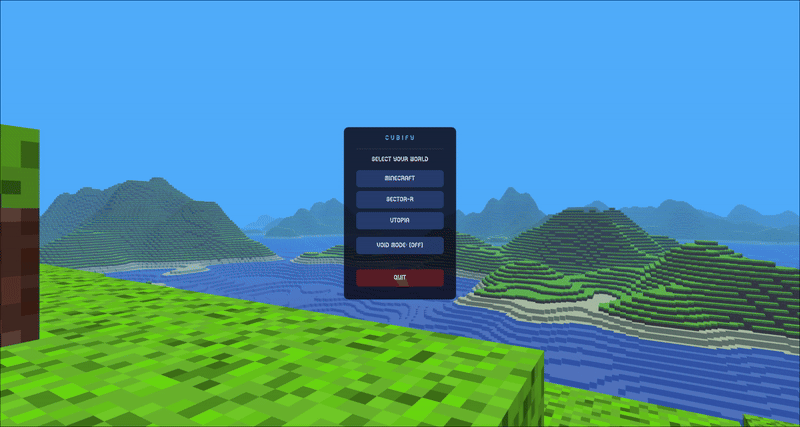

# Cubify : High performance voxel engine


Cubify is a high-performance voxel engine built with **C++17** and **OpenGL 4.3**. The project focuses on technical efficiency and procedural generation, featuring unique worlds inspired by the *Interstellar* universe.

# Screenshots
**Minecraft**

**Sector-R**

**Utopia**

**Void toggle**

**Void Utopia**


## 🌌 Key Features

* **Procedural Worlds**: Advanced terrain generation using the **Factory pattern**.
* **Physics Engine**: Custom-built player physics featuring momentum, AABB collision detection, and a seamless free-cam toggle.
* **Dynamic Audio**: Implemented via \`miniaudio\`, supporting background music and state-dependent sound effects.
* **Config System**: Settings management through \`config.json\` with support for custom seeds, render distances, and UI scaling.
* **Modern UI**: Robust Main Menu and Debug interfaces powered by \`ImGui\`.

## Optimizations

### While developing Cubify I focused on implementing high-performance one-threaded game engine.

| Feature | Technical Impact |
| :--- | :--- |
| **SSBO** | Utilizes **Shader Storage Buffer Objects** for efficient chunk data management. |
| **Data Packing** | Optimized CPU-to-GPU transfer by bit-packing vertex for 300% less memory usage. |
| **Hybrid Culling** | Combined **Frustum Culling** (6-plane) and **Face Culling** to minimize draw calls. |
| **Texture Arrays** | Uses \`GL_TEXTURE_3D_ARRAY\` to eliminate atlas bleeding and improve cache locality. |
| **PIMPL Idiom** | Enforces strict architectural separation for faster compilation and cleaner API. |

## Controls

| Key | Action |
| :--- | :--- |
| \`W, A, S, D\` | Movement |
| \`Space\` / \`L-Alt\` | Jump / Sprint |
| \`1-9\` | Choose specific block |
| \`Mouse Scroll\`| Cycle through every block |
| \`F1\` | Toggle Free-Cam / Player Mode |
| \`F3\` | Toggle Cursor visibility |
| \`F5\` | Toggle Debug UI (ImGui) |
| \`F11\` | Toggle Fullscreen |
| \`ESC\` | Return to Main Menu / Exit |

## Dependencies

They all built-in within external folder.

*   **GLFW**: Windowing and input.
*   **GLEW**: OpenGL function loading.
*   **GLM**: Mathematics.
*   **FastNoiseLite**: Noise generation for terrain.
*   **nlohmann/json**: JSON parsing for configuration.
*   **miniaudio**: Audio playback.
*   **stb_image**: Texture loading.
*   **imgui**: UI.

## Build

**Requirements**: Visual Studio 2026 with C++ workload, CMake 3.20+

### Option 1: Run the batch file in cmd
```cmd
git clone https://github.com/ovolovikk/Cubify.git
cd Cubify
build_release.bat
```

### Option 2: Manual build in cmd
```cmd
git clone https://github.com/ovolovikk/Cubify.git
cd Cubify
if not exist build mkdir build
cmake -S . -B build -G "Visual Studio 18 2026" -A x64
cmake --build build --config Release
```

The executable will be in `build/Release/Cubify.exe`
